# ⚡ CivicPulse — Crowdsourced Civic Issue Reporting and Resolution System

> **The Real-Time Heartbeat of the City**  
> *Intelligent, closed-loop civic governance powered by AI categorization, spatial duplicate prevention, automated municipal routing, and citizen-verified resolution.*

[](https://www.djangoproject.com/)
[](https://fastapi.tiangolo.com/)
[](https://postgis.net/)
[](https://leafletjs.com/)
[](https://htmx.org/)
[](https://www.docker.com/)

---

## 📌 Table of Contents

- [Overview & Vision](#-overview--vision)
- [Key Features](#-key-features)
- [9-Step Closed-Loop Resolution Workflow](#-9-step-closed-loop-resolution-workflow)
- [System Architecture](#-system-architecture)
- [AI & ML Microservice Capabilities](#-ai--ml-microservice-capabilities)
- [Role-Based Personas & Access Control](#-role-based-personas--access-control)
- [Tech Stack](#-tech-stack)
- [Project Directory Structure](#-project-directory-structure)
- [Getting Started & Installation](#-getting-started--installation)
  - [Prerequisites](#prerequisites)
  - [Option A: Local Development Setup (Quickstart)](#option-a-local-development-setup-quickstart)
  - [Option B: Docker Compose Setup](#option-b-docker-compose-setup)
- [Pre-Seeded Demo Accounts](#-pre-seeded-demo-accounts)
- [API Reference](#-api-reference)
- [Testing & Quality Assurance](#-testing--quality-assurance)
- [Future Roadmap](#-future-roadmap)
- [License & Acknowledgments](#-license--acknowledgments)

---

## 🏛️ Overview & Vision

Traditional municipal grievance redressal systems suffer from four major bottlenecks:
1. **Reporting Friction**: Citizens abandon cumbersome multi-page forms.
2. **Duplicate Avalanche**: Hundreds of citizens report the same pothole or broken streetlight, overwhelming municipal staff.
3. **Misrouting & Triage Delays**: Issues sit in the wrong department's inbox for days before being forwarded.
4. **"Ghost Resolutions"**: Tickets are marked "Resolved" administratively without physical ground verification.

**CivicPulse** is built from the ground up to solve these systemic challenges for the **Ranchi Municipal Corporation (RMC), Government of Jharkhand**.

### 🌟 Core Value Propositions
- **< 60-Second Citizen Reporting**: Instant photo upload with intelligent AI categorization and one-tap GPS pin-point placement.
- **Proactive Duplicate Prevention**: Spatial clustering (< 75m) and textual similarity algorithms merge duplicates into community upvotes (*"I See This Too"*), amplifying priority without cluttering officer queues.
- **Zero-Touch Automated Routing**: Direct dispatch to the responsible department (Roads, Sanitation, Water, Electricity, Public Health) and nearest municipal ward officer with dynamic SLA target clocks.
- **100% Verified Resolutions**: A ticket cannot be closed until the field officer uploads photo evidence and the reporting citizen verifies and rates the fix.
- **Radical Transparency**: Real-time city heartbeat portal, public SLA compliance metrics, ward leaderboards, and hotspot heatmaps.

---

## ✨ Key Features

| Category | Capability | Description |
| :--- | :--- | :--- |
| **Citizen App** | **Instant AI Pre-Scan** | As the citizen types or attaches a photo, AI instantly suggests the category, priority level, and checks for nearby existing tickets. |
| **Citizen App** | **One-Tap Confirmations** | *"I See This Too"* button allows neighbors to boost severity without creating duplicate tickets. |
| **Citizen App** | **Closed-Loop Rating** | Citizens inspect before/after photos and rate resolution quality (1 to 5 stars) before closure. |
| **Citizen App** | **Bilingual Toggle** | Seamless real-time switching between English and Hindi (`हिंदी`). |
| **Authority** | **Dynamic Triage Queue** | Filter by Department, Ward, Severity, Overdue SLA status, or keyword search with HTMX partial swaps. |
| **Authority** | **Interactive Kanban Board** | Visual 4-stage operational board (Intake ➔ Routed ➔ Dispatched ➔ Resolved) for swift progress tracking. |
| **Authority** | **Action Console** | Update ticket remarks, dispatch field staff, re-compute AI scores, and attach resolution proof images. |
| **Analytics** | **Hotspot Heatmaps** | Geospatial density map pinpointing recurring infrastructure failure clusters across Ranchi wards. |
| **Transparency** | **Public Open Portal** | Real-time stats on total grievances, SLA compliance rates, average fix times, and department performance rankings. |
| **Demo Mode** | **One-Click Persona Switcher** | Sticky top bar allows evaluators to simulate all 4 personas instantly without logging in and out. |

---

## 🔄 9-Step Closed-Loop Resolution Workflow

CivicPulse enforces an immutable audit trail across 9 distinct operational steps:

```mermaid
flowchart LR
    S1[1. SUBMITTED<br/>Citizen Photo + GPS] --> S2[2. AI_ANALYZED<br/>Auto-Category & Score]
    S2 --> S3[3. LOCATION_MAPPED<br/>Ward & Zone Pinpointed]
    S3 --> S4[4. DEPT_ROUTED<br/>SLA Target Assigned]
    S4 --> S5[5. ACKNOWLEDGED<br/>Officer Receives Ticket]
    S5 --> S6[6. DISPATCHED<br/>Field Crew on Ground]
    S6 --> S7[7. FIXED<br/>Resolution Proof Attached]
    S7 --> S8[8. CITIZEN_VERIFIED<br/>Citizen Ratings & Review]
    S8 --> S9[9. CLOSED<br/>Archived to Audit History]
```



1. **`SUBMITTED`**: Citizen captures an on-site photo and submits with automatic GPS coordinates.
2. **`AI_ANALYZED`**: FastAPI AI service analyzes description & imagery to compute category confidence and a 0–100 priority score.
3. **`LOCATION_IDENTIFIED`**: Geospatial engine maps the latitude/longitude to the exact Ranchi Municipal Ward (1–55) and Zone.
4. **`DEPT_IDENTIFIED`**: Issue auto-routes to the designated department queue (e.g. *Roads & Transport* for potholes, *Water Supply* for open manholes) with an SLA clock (12h to 72h).
5. **`OFFICER_RECEIVED`**: Department Admin or Ward Officer accepts and acknowledges the ticket.
6. **`ASSIGNED`**: Field Officer is officially dispatched to the physical site.
7. **`FIXED`**: Field Officer completes ground repairs and uploads a post-resolution verification photograph.
8. **`CITIZEN_VERIFIED`**: Citizen receives an alert, reviews the side-by-side Before/After comparison, and rates the work (1–5 stars).
9. **`CLOSED`**: Ticket is marked officially resolved and added to the city's historical analytics dataset.

---

## 🏗️ System Architecture

```
                                    +-----------------------------------------+
                                    |         Citizen / Authority UI          |
                                    |    (Vanilla CSS, HTMX, Leaflet.js)      |
                                    +--------------------+--------------------+
                                                         |
                                                HTTPS / REST / Forms
                                                         |
                                                         v
                                    +--------------------+--------------------+
                                    |        Django 4.2+ Core Backend         |
                                    |     (Authentication, RBAC, Services,     |
                                    |       Workflow Engine, SQLite/PostGIS)  |
                                    +---------+---------------------+---------+
                                              |                     |
                        HTTP /classify & /priority                  | SQL Queries
                                              |                     |
                                              v                     v
+---------------------------------------------+-----+     +---------+-----------------+
|          FastAPI AI & ML Microservice             |     |   PostgreSQL + PostGIS    |
| - NLP Keyword & Semantic Categorization           |     | - Spatial Ward Boundaries |
| - Multi-Factor Priority Engine (0-100 Score)      |     | - Relational Ticket Store |
| - Haversine + Jaccard Spatial Duplicate Detection |     | - Audit Trail Histories   |
+---------------------------------------------------+     +---------------------------+
```

---

## 🧠 AI & ML Microservice Capabilities

The AI Engine (`ai-service/`) provides sub-second intelligence for civic issue processing:

### 1. Multi-Category NLP Auto-Classification (`classify.py`)
- Supported Categories:
  - `POTHOLE`: Potholes, road craters, cracked asphalt, tarmac depressions (*Roads & Transport*).
  - `GARBAGE`: Solid waste, overflowing dumpsters, uncollected litter, rotting refuse (*Sanitation & Solid Waste*).
  - `STREETLIGHT`: Broken lamp poles, dark streets, blown fuses, electrical outages (*Electricity & Streetlights*).
  - `DRAINAGE`: Clogged drains, sewer overflow, stormwater stagnation, pipe bursts (*Water Supply & Drainage*).
  - `TOILET`: Damaged public toilets, broken urinals, missing sanitation facilities (*Public Health & Sanitation*).
  - `MANHOLE`: Hazardous uncovered manholes, open pits, missing covers (*Water Supply & Drainage*).
  - `ROAD_DAMAGE`: Damaged road dividers, broken footpaths, kerb damage (*Roads & Transport*).
- Multilingual keyword extraction (English + Romanized Hindi: *gaddha, kachra, naali, bijli, shauchalaya*).

### 2. Multi-Factor Priority Scoring Engine (`priority.py`)
Computes an objective, transparent **Priority Score (0 to 100)** based on:
$$\text{Priority Score} = \text{Base Severity} + \text{Hazard Keyword Boost} + \text{Sensitive Location Boost} + \text{Community Confirmations} + \text{Ward Density}$$

- **Tiers**:
  - `CRITICAL` (80–100): Hazardous open manholes, live electrical wires, high-traffic school/hospital zones (Immediate 12h SLA).
  - `HIGH` (60–79): Heavy road craters, sewer overflows, market waste dumps (24h–48h SLA).
  - `MEDIUM` (35–59): Dark streetlights, damaged sidewalks, residential issues.
  - `LOW` (0–34): Minor cosmetic issues, non-urgent scheduled maintenance.

### 3. Spatial & Textual Duplicate Detection (`duplicate.py`)
- **Haversine Distance**: Calculates exact distance between coordinates in meters ($R = 6,371\text{ km}$).
- **Jaccard Token Similarity**: Measures semantic overlap of issue descriptions.
- **Auto-Merge**: Reports within $75\text{m}$ with matching category trigger an alert, offering citizens the option to confirm existing issues rather than filing duplicate tickets.

### 4. Direct Fallback Architecture
If the standalone FastAPI container/process is unavailable, the Django backend automatically executes direct in-process Python fallback functions—ensuring **zero downtime** for citizens.

---

## 👥 Role-Based Personas & Access Control

CivicPulse includes customized interfaces tailored for 4 key administrative and citizen roles:

```
+-----------------------------------------------------------------------------------+
|                                 Role Permissions Matrix                           |
+-------------------+----------------+---------------+--------------+---------------+
| Capability        | CITIZEN        | FIELD_OFFICER | DEPT_ADMIN   | CITY_ADMIN    |
+-------------------+----------------+---------------+--------------+---------------+
| Report Issues     | Yes (<60s UI)  | Yes           | Yes          | Yes           |
| Upvote / Confirm  | Yes            | Yes           | Yes          | Yes           |
| Verify & Rate     | Yes (Owner)    | No            | No           | No            |
| View Public Feed  | Yes            | Yes           | Yes          | Yes           |
| Triage Queue      | No             | Ward Assigned | Dept Scoped  | All City      |
| Kanban Board      | No             | Yes           | Yes          | Yes           |
| Dispatch Officer  | No             | Self-assign   | Yes          | Yes           |
| Upload Fix Proof  | No             | Yes           | Yes          | Yes           |
| Analytics/Heatmap | Public View    | No            | Dept View    | Full Admin    |
| CSV Data Export   | No             | No            | Dept Only    | Full Export   |
+-------------------+----------------+---------------+--------------+---------------+
```

---

## 🛠️ Tech Stack

### Backend & Core
- **Framework**: Django 4.2+ (Python 3.10+)
- **API Engine**: Django REST Framework (DRF)
- **Database**: SQLite3 (Local Dev) / PostgreSQL 16 + PostGIS 3.4 (Production)
- **Asynchronous & Microservice Client**: Requests / Uvicorn

### AI & Intelligence Microservice
- **Framework**: FastAPI (ASGI)
- **Data Validation**: Pydantic v2
- **NLP / Analytics**: Regular Expression tokenizers, Jaccard similarity, Haversine spatial trigonometry

### Frontend & UI / UX
- **Design System**: Vanilla CSS with custom tokens, sleek dark topbar, glassmorphism cards, and responsive grids.
- **Dynamic Interactions**: [HTMX](https://htmx.org/) (no bulky Node.js build step needed).
- **GIS Maps**: [Leaflet.js](https://leafletjs.com/) with OpenStreetMap tiles.
- **Icons & Typography**: Inter font family, native clean SVG/Unicode iconography.

---

## 📁 Project Directory Structure

```text
CivicPulse/
├── docker-compose.yml              # Multi-container orchestration (DB, Redis, AI, Backend)
├── README.md                       # Complete Project Documentation
├── ai-service/                     # FastAPI AI Microservice
│   ├── main.py                     # API Endpoints (/classify, /priority, /duplicate-check)
│   ├── classify.py                 # NLP classification & category mapping
│   ├── priority.py                 # 0-100 Multi-factor priority score algorithm
│   ├── duplicate.py                # Haversine spatial duplicate detector
│   └── test_ai.py                  # Unit test suite for AI algorithms
└── backend/                        # Django Core Web Application
    ├── manage.py                   # Django management script
    ├── seed_data.py                # Populates Ranchi wards, departments, personas & issues
    ├── db.sqlite3                  # Local development database
    ├── civic/                      # Django project configuration
    │   ├── settings.py             # Settings, auth models, apps, & AI service URLs
    │   ├── urls.py                 # Master URL routing
    │   └── wsgi.py                 # WSGI web server configuration
    ├── accounts/                   # User authentication & Persona RBAC
    │   ├── models.py               # Custom User model (Citizen, Officer, Dept Admin, City Admin)
    │   ├── views.py                # Login, registration, role switcher
    │   └── urls.py                 # /accounts/ routes
    ├── departments/                # Administrative hierarchy
    │   ├── models.py               # Department, Zone, Ward models
    │   └── admin.py                # Django Admin registrations
    ├── reports/                    # Core issue reporting & 9-step workflow
    │   ├── models.py               # Report, ReportConfirmation, StatusHistory, Feedback
    │   ├── views.py                # Public home feed, report creation, verification, transparency
    │   ├── services.py             # Business logic layer, status progression, AI bridge
    │   ├── api.py                  # Interactive GeoJSON & AI pre-scan APIs
    │   └── urls.py                 # /report/ routes
    ├── dashboard/                  # Authority management suite
    │   ├── views.py                # Queue table, Kanban board, Action console, Analytics, CSV
    │   └── urls.py                 # /dashboard/ routes
    ├── static/                     # CSS stylesheets & client JavaScript
    │   ├── css/style.css           # Core Design System
    │   └── js/
    │       ├── app.js              # HTMX triggers, star rating, i18n translation engine
    │       └── map.js              # Leaflet GIS map rendering & GPS pin picker
    └── templates/                  # Modular HTML templates
        ├── base.html               # Main layout, sticky navigation & demo role switcher
        ├── accounts/               # Login & Registration views
        ├── citizen/                # Citizen home, submit form, tracker, transparency portal
        └── dashboard/              # Queue, Kanban, Action console, Heatmap analytics
```

---

## 🚀 Getting Started & Installation

### Prerequisites
- **Python 3.10+**
- **pip** (Python package installer)
- *(Optional)* **Docker & Docker Compose** (for containerized deployment)

---

### Option A: Local Development Setup (Quickstart)

#### 1. Clone or Open the Repository
```bash
cd "CivicPulse — Crowdsourced Civic Issue Reporting and Resolution System"
```

#### 2. Set Up the AI Microservice (Terminal 1)
```bash
cd ai-service
pip install fastapi uvicorn pydantic python-multipart requests
python main.py
```
> The AI Microservice will run at `http://127.0.0.1:8001` (API Docs at `http://127.0.0.1:8001/docs`).

#### 3. Set Up the Django Backend (Terminal 2)
```bash
cd backend
pip install django djangorestframework requests pillow

# Run migrations
python manage.py migrate

# Populate realistic Ranchi wards, departments, users & issue tickets
python seed_data.py

# Start the web server
python manage.py runserver 127.0.0.1:8000
```
> Open your browser and navigate to **`http://127.0.0.1:8000`**.

---

### Option B: Docker Compose Setup

To spin up the entire production stack (PostGIS Database, Redis, FastAPI AI Microservice, and Django Backend):

```bash
docker-compose up --build
```

- **Citizen & Authority Portal**: `http://localhost:8000`
- **FastAPI Interactive Docs**: `http://localhost:8001/docs`
- **PostgreSQL / PostGIS Database**: `localhost:5432`

---

## 🔑 Pre-Seeded Demo Accounts

The project includes pre-configured persona accounts for testing all workflows.  
**Default Password for all demo accounts:** `pass123`

| Username | Role | Persona Name | Assigned Jurisdiction | Primary Scope |
| :--- | :--- | :--- | :--- | :--- |
| `rahul_citizen` | **Citizen Reporter** | Rahul Kumar | Ward 14 (Lalpur Chowk) | Report issues, upvote neighbors, verify fixes |
| `anjali_citizen` | **Citizen Reporter** | Anjali Kumari | Ward 26 (Doranda North) | Report issues, rate satisfaction |
| `rohit_citizen` | **Citizen Reporter** | Rohit Verma | Ward 8 (Kanke Road) | Active community contributor |
| `officer_vikas` | **Field Officer** | Vikas Paharia | Roads & Transport (Ward 14) | Resolve potholes & upload photo proofs |
| `officer_priya` | **Field Officer** | Priya Tirkey | Sanitation (Ward 14) | Clear solid waste & manage sweepers |
| `officer_rajesh` | **Field Officer** | Rajesh Gope | Water Supply (Ward 26) | Drain unclogging & manhole cover repairs |
| `admin_roads` | **Dept Admin** | B. K. Sahay | Roads & Transport | Department-wide dispatching & SLA monitoring |
| `admin_sanitation` | **Dept Admin** | S. Lakra | Sanitation & Waste | City waste collection operations |
| `city_commissioner`| **City Administrator** | Sanjeev Ranjan | Ranchi Municipal Corp | City-wide oversight, Kanban, Hotspots, CSV |

> 💡 **Tip:** Use the **Quick Demo Persona Switcher** bar at the top of any page to switch between these roles with a single click.

---

## 📡 API Reference

### 1. AI Microservice Endpoints (`http://127.0.0.1:8001`)

#### `POST /classify`
Auto-classifies an issue description into category, department, and recommended SLA.
```json
// Request Body
{
  "text": "Deep dangerous pothole on main road causing accidents",
  "filename": "broken_road.jpg"
}

// Response
{
  "status": "success",
  "data": {
    "category": "POTHOLE",
    "category_label": "Potholes & Crater Damage",
    "confidence": 0.84,
    "department": "Roads & Transport",
    "matched_keywords": ["pothole", "accident"],
    "sla_hours": 48
  }
}
```

#### `POST /priority`
Computes the 0–100 priority score and severity badge with contributing rationale.
```json
// Request Body
{
  "category": "MANHOLE",
  "description": "Open manhole near school, high danger of kids falling in",
  "confirmation_count": 5,
  "is_sensitive_location": true,
  "reported_count_in_ward": 3
}

// Response
{
  "status": "success",
  "data": {
    "priority": "CRITICAL",
    "priority_score": 95,
    "badge_color": "#DC2626",
    "factors": [
      "Base hazard score for MANHOLE: +85",
      "Hazard keywords detected (danger): +10",
      "High-density / sensitive public zone (school): +5",
      "5 citizen confirmations ('I see this too'): +15"
    ]
  }
}
```

#### `POST /duplicate-check`
Checks spatial proximity and text similarity against active open reports.

---

### 2. Django Backend Interactive Endpoints (`http://127.0.0.1:8000`)

- **`GET /api/map-points/`**: Returns GeoJSON of all active and resolved issues for Leaflet map markers.
- **`POST /api/prescan/`**: Real-time pre-submission endpoint that classifies text and flags duplicates simultaneously.
- **`GET /dashboard/export/csv/`**: Exports filtered municipal audit logs and issue reports in CSV format.

---

## 🧪 Testing & Quality Assurance

### Running AI Microservice Unit Tests
```bash
cd ai-service
python -m unittest test_ai.py
```
**Test Coverage:**
- ✅ Keyword classification accuracy for all 7 civic categories.
- ✅ Multi-factor priority score calculation & hazard keyword multipliers.
- ✅ Haversine spatial distance precision (< 50m).
- ✅ Duplicate detection logic and threshold sensitivity.

---

## 🗺️ Future Roadmap

- [ ] **WhatsApp & SMS Chatbot Ingestion**: Allow citizens without smartphones to submit complaints via WhatsApp media messages and Twilio SMS.
- [ ] **Edge Vision ML Integration**: On-device TensorFlow Lite / YOLOv8 model for real-time pothole depth and garbage volume estimation.
- [ ] **Automated Contractor SLA Penalties**: Smart contract or automatic financial deduction if contractors breach fixed SLA deadlines.
- [ ] **IoT Sensor Integration**: Live integration with smart water-level sensors in drainage canals and smart streetlight meters.

---

## 📄 License & Acknowledgments

- **Hackathon Theme**: Smart Cities / Clean & Green Technology (SIH25031)
- **Target Implementation**: Ranchi Municipal Corporation (RMC), Urban Development & Housing Department, Government of Jharkhand.
- **License**: MIT Open Source License.

---

<p align="center">
  <strong>CivicPulse</strong> — <i>Empowering Citizens, Accelerating Governance.</i>
</p>
